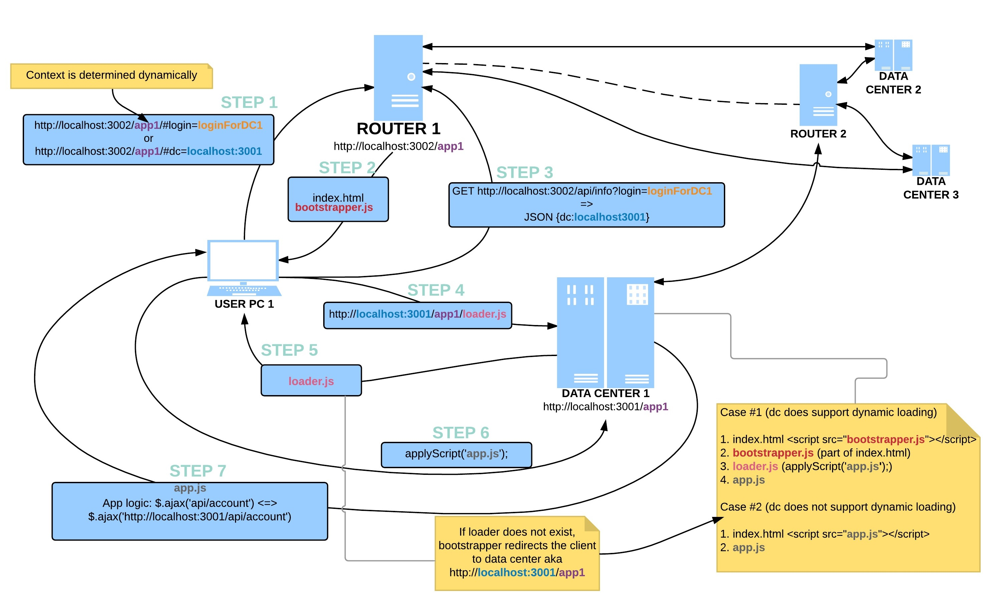
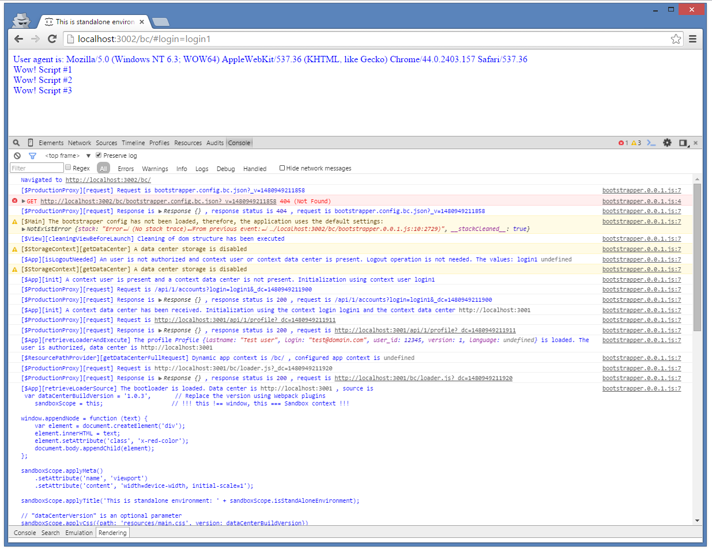

# A bootstrapper of web-application based on TypeScript 2.0 and Webpack 2.x

## Description

This web application (bootstrapper) has an ability to apply foreign web-module dynamically.  

Generally, an environment consists of two servers:  
1. Router (localhost:3002)  
2. Data center (localhost:3001)  

The **Loader** script (loader.js) should be located on the router or a data center:  

```sh
localhost:3002/bc/loader.js
or
localhost:3001/bc/loader.js
```

The **Bootstrapper** script (bootstrapper.js) should be located on the router or a data center:  

```sh
localhost:3002/bc/bootstrapper.js
or
localhost:3001/bc/bootstrapper.js
```

Application context (/bc/) is determined dynamically and dependent from your environment.

The **Bootstrapper** supports **3 operating modes**:  

1. Router + Data center (Star topology)  
2. Data center + Data center (Loopback)  
3. Standalone Data center (internet/intranet is not available and data center REST Info API is not available (probe REST API method))  

The application can work in isomorphic mode. You can provide your implementations of Document and configure it via DI:

```typescript
IoC.bind<ISandboxDocument>(SandboxDocument).toConstantValue(<ServerDocumentInstance extends Document>);
```

The main starting point is [app.ts](src/app.ts).  

Also, the application supports dynamic override of configuration via special file:  

```javascript
bootstrapper.config.<APP_NAME>.json
```

where <APP_NAME> is determined automatically and dependent on URI path of the app.

```typescript
export interface AppConfig {
    IS_STANDALONE_MODE?:boolean;                // the default value is false
    DATA_CENTER_APP_PATH?:string;               // the default value is determined automatically => 'http://data-center.domain.com/<DATA_CENTER_APP_PATH>'
    RETURN_URI?:string;                         // the default value is 'return_url'
    API_PATH?:string;                           // the default value is '/api'
    API_VERSION?:string;                        // the default value is '1'
    ACCOUNT_API_PATH?:string;                   // the default value is 'accounts'
    PROFILE_API_PATH?:string;                   // the default value is 'profile', can be null or '' explicitly and can not be considered
    DATA_CENTER_CONTEXT_PARAM?:string;          // the default value is 'dc'
    LOGIN_CONTEXT_PARAM?:string;                // the default value is 'login'
    LOGIN_ROUTE_PATH?:string;                   // the default value is '/login', can be null explicitly and can not be considered
    DATA_CENTER_STORAGE_PARAM?:string;          // the default value is 'host'
    LOGIN_STORAGE_PARAM?:string;                // the default value is 'username'
    USE_LOGIN_CONTEXT?:boolean;                 // the default value is true
    USE_DATA_CENTER_CONTEXT?:boolean;           // the default value is true
    USE_LOGIN_STORAGE?:boolean;                 // the default value is true
    USE_DATA_CENTER_STORAGE?:boolean;           // the default value is false [in production mode]
}
```



## Dependencies

* [core-js](https://www.npmjs.com/package/core-js)  
* [bluebird](https://www.npmjs.com/package/bluebird)  
* [inversify](https://www.npmjs.com/package/inversify)  
* [js-cookie](https://www.npmjs.com/package/js-cookie)  
* [urijs](https://www.npmjs.com/package/urijs)  
* [ts-smart-logger](https://www.npmjs.com/package/ts-smart-logger)  

## Use

Sandbox environment provides a couple of useful methods and variables:  

1. **applyScript** (return bluebird Promise) - allows dynamically load the another script from the data center or call the function directly.  
**Since the scripts added via tag after a DOMContentLoaded event has been executed, are loaded and executed asynchronously, we should apply some logic-scripts (vendor.js+app.js) using "waterfall" technique.**  
2. **applyTitle** - allows dynamically change a title.  
3. **applyMeta** - allows dynamically add a meta tag to DOM header element.  
4. **applyCss** (return bluebird Promise) - allows dynamically apply css link to DOM header element.  
5. **applyLink** - allows dynamically apply link to DOM header element.  
6. **applyElement** - allows dynamically apply DOM-element (div, form, ..) to DOM body element.  
7. **applyBasePath** - allows dynamically change path of base DOM-element.  
8. **applyDataCenterBasePath** - allows dynamically change path of base DOM-element to the current data center base path.  
Generally, we don't have to do this if the loaded application works with absolute URL (http://datacenter.com/api/..)  
9. **isStandAloneEnvironment** - whether works **Loader** a standalone environment or no  

#### loader.js
```javascript
var dataCenterBuildVersion = '1.0.3',       // Replace the version using Webpack plugins
	sandboxScope = this;                    // !!! this !== window, this === Sandbox context !!!

window.appendNode = function (text) {
	var element = document.createElement('div');
	element.innerHTML = text;
	element.setAttribute('class', 'x-red-color');
	document.body.appendChild(element);
};

sandboxScope.applyMeta()
	.setAttribute('name', 'viewport')
	.setAttribute('content', 'width=device-width, initial-scale=1');

sandboxScope.applyTitle('This is standalone environment: ' + sandboxScope.isStandAloneEnvironment);

// "dataCenterVersion" is an optional parameter
sandboxScope.applyCss({path: 'resources/main.css', version: dataCenterBuildVersion})
	.then(function () {
		// The patch is loaded strictly after the main file
		return sandboxScope.applyCss({path: 'resources/main.patch.css', version: dataCenterBuildVersion})
	});

sandboxScope.applyElement('div')
	.setAttribute('id', 'loadingscreen')
	.setAttribute('class', 'splash')
	.setInnerHtml('<div class="splash-inner"></div>');

sandboxScope.applyScript({
	fnOrPath: 'polyfills.bundle.js',
	version: dataCenterBuildVersion                                  // "dataCenterVersion" is an optional parameter
}).then(function () {
	return sandboxScope.applyScript({
		fnOrPath: 'vendor.bundle.js',
		version: dataCenterBuildVersion
	}).then(function () {
		return sandboxScope.applyScript({
			fnOrPath: 'main.bundle.js',
			version: dataCenterBuildVersion
		});
	});
});

sandboxScope.applyScript({
	fnOrPath: function () {
		window.appendNode('User agent is: ' + navigator.userAgent);
	}
});
```

#### polyfills.bundle.js
```javascript
appendNode("Wow! Script #1");
```

#### vendor.bundle.js
```javascript
appendNode("Wow! Script #2");
```

#### main.bundle.js
```javascript
appendNode("Wow! Script #3");
```




## Start

At first, you should start the application using this command:

```sh
npm run start
```

Then you can open your browser and start to play with the application using the urls:

```sh
http://localhost:3002/bc/#login=login1
http://localhost:3001/bc/#login=login1
```

## Build

Also, you can build your application using the command:

```sh
npm run assembly:prod
```

## Debugging

You should enable the logging using command
```javascript
localStorage.setItem('__logConfig', JSON.stringify({"logLevel": 7}));
```
See also [ts-smart-logger](https://www.npmjs.com/package/ts-smart-logger).  

## License

Licensed under MIT.